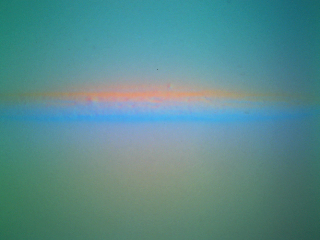

# Data Collection Guide

## Canonical Orientation

Before collecting data, you need to decide on a **canonical 0° reference orientation** for your object. All training images should be captured at this same rotational orientation. The model will then learn to detect rotational deviation relative to this reference.

### Example: stick placed horizontally at the center of the sensor

The image below shows the canonical placement used in our provided example data — a stick laid **horizontally across the center** of the GelSight sensor:





- The object is placed **at the same rotational orientation** in every training image.
- Small **translational shifts** (sliding the object slightly left/right/up/down while keeping the same rotation) are encouraged — they improve robustness without breaking the orientation label.
- Do **not** rotate the object between captures.

> **Tip:** For the stick example, "horizontal" means the long axis runs left-to-right across the sensor face. Choose whichever orientation is most natural for your use case and stay consistent.

---

## Collecting Training Data

Place the object on the sensor at the canonical orientation, then run:

```bash
python collect_data/collect_data.py --mode data --save_dir data
```

Press `k` to save the current frame, `q` / `ESC` to quit.

### How many images?

3–5 images at the canonical orientation are sufficient. Translational variation within those captures is recommended.

---

## Notes on Applicability

- For most objects, the method detects residual orientation relative to the canonical angle within **±90°**.
- The method is **not applicable** to objects with full 360°/90° rotational symmetry (e.g., circular objects).
